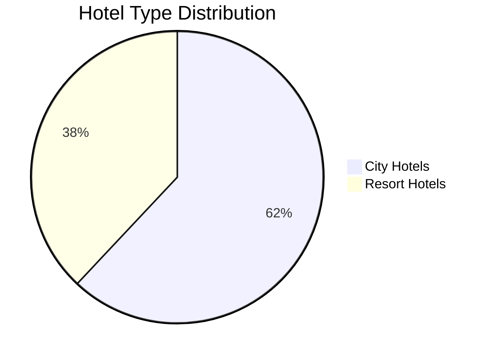
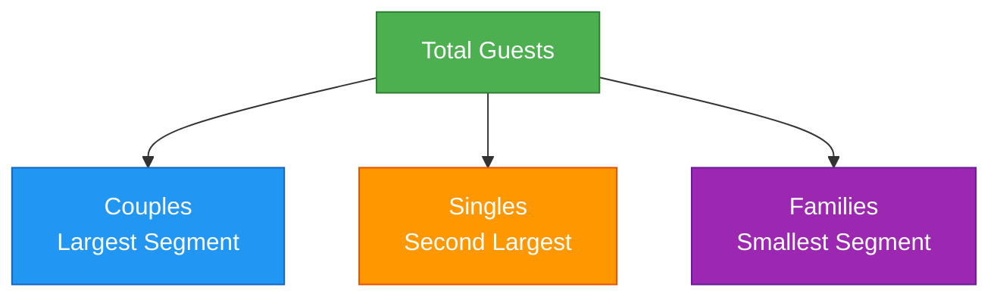
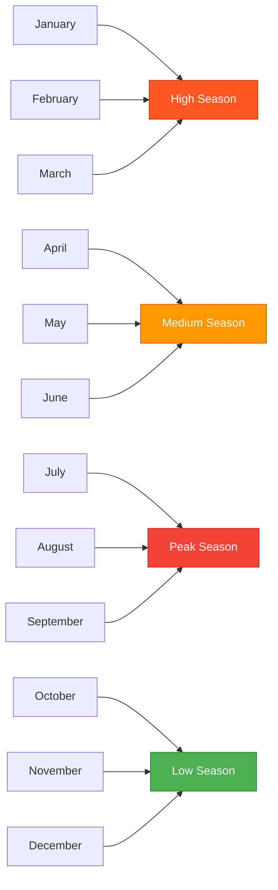
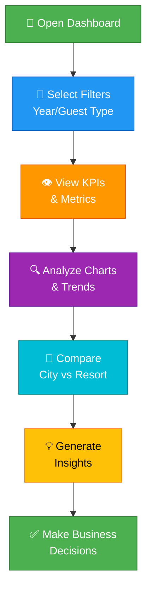

<div align="center">

# 🏨 Hotel Booking Dashboard in Excel

### Interactive Excel Dashboard for Hotel Analytics

[](https://www.microsoft.com/excel)
[](#)
[](LICENSE)

**Analyzing Hotel Booking Trends, Cancellations, and Guest Patterns**


</div>

---

## 📋 Project Overview

An **interactive Excel dashboard** designed to analyze **hotel booking trends, cancellations, and guest patterns** across 2015-2017.

This dashboard provides quick business insights for decision-making using:
- 📊 Excel visuals
- 📈 Dynamic charts  
- 🎯 KPI cards
- 🔍 Slicers and filters

---

## 🖼️ Dashboard Preview


*Interactive dashboard showcasing hotel booking analytics with multiple visualizations*

---

## 🎯 Dashboard Features

```mermaid
graph LR
    A[📊 Raw Data] --> B[🧽 Data Cleaning]
    B --> C[📈 Power Query]
    C --> D[📊 Pivot Tables]
    D --> E[🎨 Visualizations]
    E --> F[📱 Interactive Dashboard]
    F --> G[📊 Business Insights]
    
    style A fill:#E3F2FD,stroke:#1976D2,color:#000
    style B fill:#FFF3E0,stroke:#F57C00,color:#000
    style C fill:#E8F5E9,stroke:#388E3C,color:#000
    style D fill:#F3E5F5,stroke:#7B1FA2,color:#000
    style E fill:#FFF9C4,stroke:#F9A825,color:#000
    style F fill:#C8E6C9,stroke:#66BB6A,color:#000
    style G fill:#FFE0B2,stroke:#FF6F00,color:#000
```



<div align="center">

### 🌟 Key Dashboard Components

| Feature | Description |
|---------|-------------|
| 📊 **Dynamic Charts** | Pie, Bar, and Column Charts with live updates |
| 📅 **Year Filter** | Filter data across 2015-2017 |
| 👥 **Guest Segmentation** | Analyze by couples, singles, and families |
| 🏝️ **Hotel Type Comparison** | City vs Resort hotel insights |
| 📊 **KPI Cards** | Quick metrics at a glance |
| 🎨 **Professional Theme** | Dark green and gold color scheme |

</div>

---

## 📈 Key Insights Displayed

### 📊 Summary KPIs

<div align="center">

| Metric | Value | Icon |
|--------|-------|------|
| **Total Bookings** | 119,390 | 📊 |
| **Total Cancellations** | 44,224 | ❌ |
| **Reservation Cancellations** | 43,018 | 🛑 |
| **Reservation Check-Outs** | 75,167 | ✅ |
| **Cancellation Rate** | 37% | 📉 |

</div>

---

### 🔍 Comparative Analysis



#### 🏛️ City vs Resort Analysis:

- **City Hotels**: 62% of total bookings
- **Resort Hotels**: 38% of total bookings
- **City Hotel Cancellations**: 74% cancellation rate
- **Resort Hotel Cancellations**: 26% cancellation rate

---

### 👥 Guest Type Breakdown



**Key Finding**: "Coupled" guests represent the largest segment, followed by singles and families.

---

### 📅 Yearly Trends (2015-2017)

<details>
<summary><b>Click to expand yearly breakdown</b></summary>

| Year | Bookings | Cancellations | Check-Outs |
|------|----------|--------------|------------|
| **2015** | ~35,000 | ~12,000 | ~23,000 |
| **2016** | ~45,000 | ~17,000 | ~28,000 |
| **2017** | ~39,000 | ~15,000 | ~24,000 |

**Trend**: Bookings peaked in 2016, with consistent cancellation patterns across all years.

</details>

---

### 📉 Monthly Booking vs Cancellations



**Visual Comparison**: The dashboard provides month-by-month comparison of desired vs undesired (cancelled) bookings.

---

## 💡 Business Questions Answered

<div align="center">

| Question | Answer |
|----------|--------|
| ❓ Which hotel type has higher cancellations? | 🏛️ **City Hotels** (74% of cancellations) |
| ❓ How do booking trends vary across years? | 📈 **2016 showed peak bookings** |
| ❓ What guest type contributes most to cancellations? | 👥 **Couples are the largest segment** |
| ❓ Which months show highest cancellation rates? | 📅 **Peak seasons** (July-September) |
| ❓ What's the overall cancellation rate? | 📊 **37%** of total bookings |

</div>

---

## 🛠️ Tools & Technologies

<div align="center">

| Tool | Purpose | Version |
|------|---------|--------|
| 📊 **Microsoft Excel** | Dashboard development | 2016+ |
| 📂 **Power Query** | Data cleaning & transformation | Built-in |
| 📊 **Pivot Tables** | Data aggregation | Native |
| 📈 **Excel Charts** | Visualizations | Standard |
| 🎯 **Slicers** | Interactive filtering | Native |
| 🎨 **Conditional Formatting** | Visual enhancements | Custom |

</div>

---

## 📁 Project Structure

```
Hote_Booking_Dashboards_in_Excel/
├── Dashboards file.xlsx          # Main dashboard file
├── Dashboards preview.png        # Dashboard screenshot
├── hotel_booking.csv             # Raw dataset
├── .gitattributes                # Git LFS configuration
└── README.md                     # This file
```

---

## 🚀 Getting Started

### Prerequisites

- Microsoft Excel 2016 or later
- Power Query enabled (usually pre-installed)
- Basic understanding of Excel dashboards

### How to Use

1. **Download the dashboard file**
   ```
   Download: Dashboards file.xlsx
   ```

2. **Open in Excel**
   - Enable macros if prompted (for full interactivity)
   - Ensure data connections are refreshed

3. **Interact with the Dashboard**
   - Use year slicers to filter data (2015-2017)
   - Click on charts for drill-down analysis
   - Explore different guest types and hotel categories

4. **Refresh Data** (Optional)
   - Load `hotel_booking.csv` if you want to update data
   - Use Power Query to refresh connections

---

## 📊 Dashboard Workflow



---

## 🎯 Key Features

✅ **Interactive Slicers** - Filter by year and guest type  
✅ **Dynamic KPI Cards** - Real-time metric updates  
✅ **Professional Design** - Dark green and gold theme  
✅ **Comprehensive Analysis** - Multiple chart types  
✅ **Easy to Use** - No complex setup required  
✅ **Business-Ready** - Presentation-quality visuals  

---

## 💼 Business Value

### 📈 Actionable Insights:

1. **Reduce Cancellations**: Focus on city hotels where cancellation rate is 74%
2. **Target Marketing**: Couples represent the largest guest segment
3. **Seasonal Planning**: Optimize pricing during peak months (July-Sept)
4. **Resource Allocation**: Prepare for higher demand in 2016-like years
5. **Guest Experience**: Tailor services for different guest types

---

## 📝 Data Source

- **Dataset**: Hotel booking data (2015-2017)
- **Records**: ~119,000 bookings
- **Features**: 18+ columns including:
  - Hotel type, Booking dates, Guest types
  - Cancellation status, Room details
  - Special requests, Payment info

---

## 🤝 Contributing

Contributions are welcome! Feel free to:
- 🐛 Report issues
- ✨ Suggest enhancements
- 📝 Improve visualizations
- 🔀 Submit pull requests

---

## 📝 License

This project is licensed under the MIT License.

---

## 💬 Contact

<div align="center">

**Harsh Choudhary**

[](https://github.com/HarshChoudhary2003)
[](https://linkedin.com/in/harsh-choudhary)

---

### ⭐ If you find this dashboard helpful, please give it a star! ⭐

**Built with ❤️ and 📊 in Excel**

</div>
